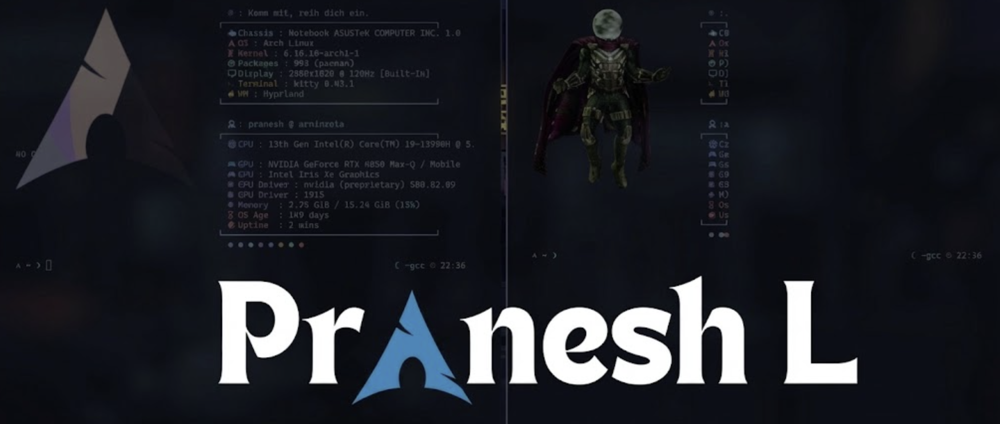

<!-- 

 -->

 
 

 <h2><i> About me </i></h2> 
 <h3><i>I am a Philomath and I love working with deep machine learning, computational modelling of dynamical systems, and simulations. I also have a huge love for networking and low-level programming. I love to apply AI to the field of scientific research by developing new algorithms... as I said, I have an urge to learn everything related to technology. 
  I am currently learning about Cars and things related to automobile engineering to see whether I could apply AI there to bring game-changing solutions.  
  I am currently pursuing my B.Tech in Artificial Intelligence and Data Science from</i> <b><em>Amrita Vishwa Vidyapeetham</em></b>.</h3>

<!-- 

  <i>I am a Philomath and I love working with deep machine learning, computational modelling of dynamical systems, and simulations. I also have a huge love for networking and low-level programming. I love to apply AI to the field of scientific research by developing new algorithms... as I said, I have an urge to learn everything related to technology.  
  I am currently learning about Cars and things related to automobile engineering to see whether I could apply AI there to bring game-changing solutions.  
  I am currently pursuing my B.Tech in Artificial Intelligence and Data Science from</i> <b><em>Amrita Vishwa Vidyapeetham</em></b>.  
  .I would like to utilize this platform to learn, collaborate with aspiring minds, and grow as a community ✨.

 -->

<!--  -->
 
 

  &nbsp;&nbsp;&nbsp;&nbsp;&nbsp;&nbsp;&nbsp;&nbsp;&nbsp;&nbsp;&nbsp;&nbsp;&nbsp;&nbsp;&nbsp;&nbsp;&nbsp;&nbsp;&nbsp;&nbsp;&nbsp;&nbsp;&nbsp;&nbsp;&nbsp;&nbsp;&nbsp;&nbsp;
  &nbsp;&nbsp;&nbsp;&nbsp;&nbsp;&nbsp;&nbsp;&nbsp;&nbsp;&nbsp;&nbsp;&nbsp;&nbsp;&nbsp;&nbsp;&nbsp;&nbsp;&nbsp;&nbsp;&nbsp;&nbsp;&nbsp;&nbsp;&nbsp;&nbsp;&nbsp;&nbsp;
  &nbsp;&nbsp;&nbsp;&nbsp;&nbsp;&nbsp;&nbsp;&nbsp;&nbsp;&nbsp;&nbsp;&nbsp;&nbsp;&nbsp;&nbsp;&nbsp;&nbsp;&nbsp;&nbsp;&nbsp;
  

<!--  -->

  <h2><i> I'm currently working on : </i></h2> <h3><i>Project Asterion - A neuro symbolic video understanding , question answering and reasoning AI having applications in numerous edge devices and day to day useful devices , It will be available even in Cooling glasses 😎 and smart phones, as a helpful assisant in visual tasks STAY TUNED</i></h3>
  

  

<!--  -->

 
 

  <h2><i> Recent work </i></h2> <h3><i>An open source order matching engine in Rust to allow seamless trading without any latency to process millions of trades and this engine is the core of it </i></h3>

  

  

 
                             
                               

  
 

&nbsp;

  <h2><i> Languages Tools and Technologies </i></h2>

  &nbsp;
  &nbsp;
  &nbsp;
  &nbsp;
  &nbsp;
  &nbsp;
  &nbsp;
  &nbsp;
  &nbsp;
  &nbsp;
  &nbsp;
  &nbsp;
  &nbsp;
  &nbsp;
  &nbsp;
  &nbsp;
  &nbsp;
  &nbsp;
  &nbsp;
  &nbsp;
  &nbsp;
  &nbsp;
  &nbsp;
  &nbsp;
  &nbsp;
  &nbsp;
  &nbsp;
  &nbsp;
  &nbsp;
  &nbsp;
  &nbsp;
  &nbsp;
  &nbsp;
  &nbsp;
  &nbsp;
  &nbsp;
  

<h2><i>Socials</i></h2>

  &nbsp;&nbsp;&nbsp;&nbsp;&nbsp;
  &nbsp;&nbsp;&nbsp;&nbsp;&nbsp;
  &nbsp;&nbsp;&nbsp;&nbsp;&nbsp;
  
    

<!--
**lpranesh/lpranesh** is a ✨ _special_ ✨ repository because its `README.md` (this file) appears on your GitHub profile.

Here are some ideas to get you started:

- 🔭 I’m currently working on ...
- 🌱 I’m currently learning ...
- 👯 I’m looking to collaborate on ...
- 🤔 I’m looking for help with ...
- 💬 Ask me about ...
- 📫 How to reach me: ...
- 😄 Pronouns: ...
- ⚡ Fun fact: ...
-->

