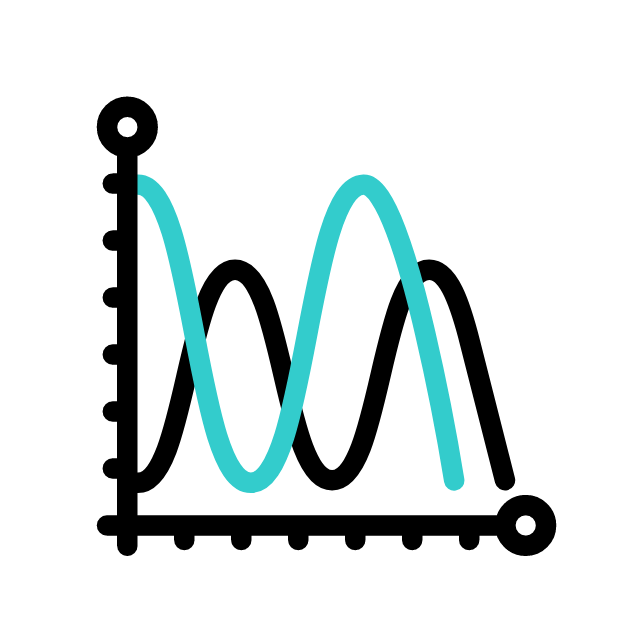
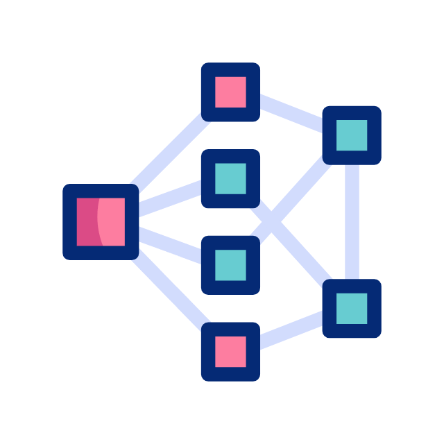

  <h1>Hey &nbsp;&nbsp;&nbsp; &nbsp;&nbsp;&nbsp;I'm Pranesh L</h1>

  <i>I am an AI enthusiast and I aspire to expand my interest over quantum computing, deep machine learning, and computational modelling of dynamical systems and be an integral part of this age of 
  A.I. I love to apply AI to the field of scientific research by developing new algorithms.I am currently pursuing my B.Tech in Artificial Intelligence and Data Science from</i> <em><b>Amrita Vishwa 
  Vidyapeetham<b></em> .    &nbsp;&nbsp;&nbsp;&nbsp;&nbsp;&nbsp;&nbsp;&nbsp;&nbsp;&nbsp;....I would like to utilize this platform to learn, collaborate with aspiring minds, and grow as a community ✨.

  &nbsp;&nbsp;&nbsp;&nbsp;&nbsp;&nbsp;&nbsp;&nbsp;&nbsp;&nbsp;&nbsp;&nbsp;&nbsp;&nbsp;&nbsp;&nbsp;&nbsp;&nbsp;&nbsp;&nbsp;
  &nbsp;&nbsp;&nbsp;&nbsp;&nbsp;&nbsp;&nbsp;&nbsp;&nbsp;&nbsp;
  &nbsp;&nbsp;&nbsp;&nbsp;&nbsp;&nbsp;&nbsp;&nbsp;&nbsp;&nbsp;
  

  <h2><i> I'm currently working on : </i></h2> <h3><i>A Stanford problem for predicting 3D structure of RNA from its sequence using Deep learning</i></h3>
  

 
 

  <h2><i> Recent work </i></h2> <h3><i>A visual workflow and architecture diagram generation model from a manually crafted custom dataset</i></h3>
  

 
 
                             
                               
 <h2><i> Tools and Technologies </i></h2>
 

    &nbsp;&nbsp;&nbsp;&nbsp;&nbsp;
    &nbsp;&nbsp;&nbsp;&nbsp;&nbsp;
    &nbsp;&nbsp;&nbsp;&nbsp;&nbsp;
    &nbsp;&nbsp;&nbsp;&nbsp;&nbsp;
    &nbsp;&nbsp;&nbsp;&nbsp;&nbsp;
    &nbsp;&nbsp;&nbsp;&nbsp;&nbsp;
    &nbsp;&nbsp;&nbsp;&nbsp;&nbsp;
    &nbsp;&nbsp;&nbsp;&nbsp;&nbsp;
    &nbsp;&nbsp;&nbsp;&nbsp;&nbsp;
    &nbsp;&nbsp;&nbsp;&nbsp;&nbsp;
    &nbsp;&nbsp;&nbsp;&nbsp;&nbsp;
    &nbsp;&nbsp;&nbsp;&nbsp;&nbsp;
    &nbsp;&nbsp;&nbsp;&nbsp;&nbsp;
    
   
 

  
 

 
<h2><i> Connect with me </i></h2>

  &nbsp;&nbsp;&nbsp;&nbsp;&nbsp;
  
    

<!--
**lpranesh/lpranesh** is a ✨ _special_ ✨ repository because its `README.md` (this file) appears on your GitHub profile.

Here are some ideas to get you started:

- 🔭 I’m currently working on ...
- 🌱 I’m currently learning ...
- 👯 I’m looking to collaborate on ...
- 🤔 I’m looking for help with ...
- 💬 Ask me about ...
- 📫 How to reach me: ...
- 😄 Pronouns: ...
- ⚡ Fun fact: ...
-->

